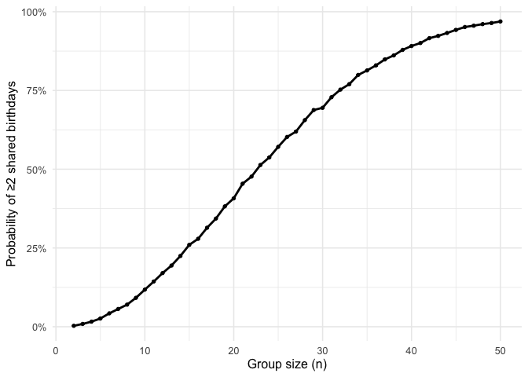
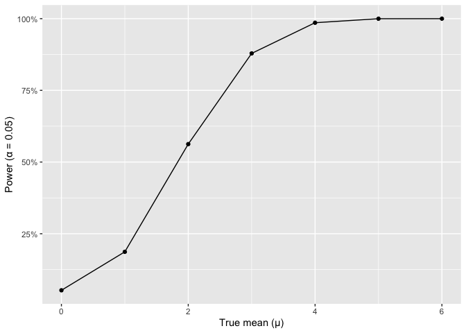
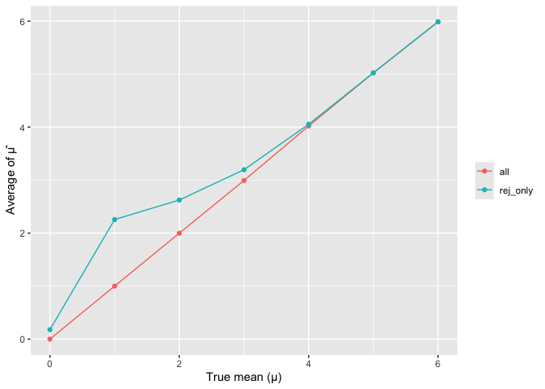

p8105_hw5_yd2810
================
Yaxuan Deng
2025-11-14

``` r
library(tidyverse)
```

    ## ── Attaching core tidyverse packages ──────────────────────── tidyverse 2.0.0 ──
    ## ✔ dplyr     1.1.4     ✔ readr     2.1.5
    ## ✔ forcats   1.0.1     ✔ stringr   1.6.0
    ## ✔ ggplot2   3.5.2     ✔ tibble    3.3.0
    ## ✔ lubridate 1.9.4     ✔ tidyr     1.3.1
    ## ✔ purrr     1.2.0     
    ## ── Conflicts ────────────────────────────────────────── tidyverse_conflicts() ──
    ## ✖ dplyr::filter() masks stats::filter()
    ## ✖ dplyr::lag()    masks stats::lag()
    ## ℹ Use the conflicted package (<http://conflicted.r-lib.org/>) to force all conflicts to become errors

``` r
library(broom)
```

## Problem 1

``` r
set.seed(1234)

share_birthday <- function(n){
  birthday <- sample.int(365,size=n,replace = TRUE)
  any(duplicated(birthday))
}

n_seq <- 2:50
n_sim <- 10000

# simulate each n and estimate probability
simulation <- 
  map_dfr(n_seq,\(n){
    tibble(
      n=n,
      prob = mean(replicate(n_sim, share_birthday(n)))
    )
  })
```

``` r
ggplot(simulation, aes(x = n, y = prob)) +
  geom_line(linewidth = 1) +
  geom_point(size = 1.2) +
  scale_y_continuous(labels = scales::percent_format(accuracy = 1)) +
  labs(x = "Group size (n)",
       y = "Probability of ≥2 shared birthdays") +
  theme_minimal(base_size = 12)
```

<!-- -->
According to the plot, the probability of at least two people have
shared birthdays reaches 50% at around a group size of 23, and exceeds
90% at around group size 41. The curve first rises at a slower rate for
group size lower than 10, than has a tendency of increases faster as `n`
increases until the probability becomes relatively large.

## Problem 2

``` r
set.seed(4321)

n <- 30
sigma <- 5
n_sim <- 5000
mu_grid <- c(0,1:6)

sim_once <- function(mu){
  x <- rnorm(n, mean = mu, sd = sigma)
  tt <- t.test(x, mu = 0) %>% tidy()
  tibble(mu = mu,
         mu_hat = tt$estimate,
         p = tt$p.value,
         rej = tt$p.value < 0.05)
}

sim_tbl <- map_dfr(mu_grid, ~map_dfr(1:n_sim, \(.) sim_once(.x)))
```

``` r
# plot 1
power_tbl <- sim_tbl %>% 
  group_by(mu) %>% 
  summarise(power = mean(rej), .groups = "drop")

ggplot(power_tbl, aes(mu, power))+
  geom_line()+ geom_point()+
  scale_y_continuous(labels = scales::percent_format()) +
  labs(x = "True mean (μ)", y = "Power (α = 0.05)")
```

<!-- -->

Power increases with the true mean μ when n=30, σ=5. It is close to 0
when μ=0, and approximately reaches 100% by μ≥4. Larger effects make
one-sample t-test rejects more often.

``` r
avg_tbl <- sim_tbl %>% 
  group_by(mu) %>% 
  summarise(all = mean(mu_hat),
            rej_only = mean(mu_hat[rej]),
            .groups = "drop") %>% 
  pivot_longer(-mu, names_to = "set", values_to = "avg_mu_hat")

ggplot(avg_tbl, aes(mu, avg_mu_hat, color = set)) +
  geom_line()+ geom_point()+
  labs(x = "True mean (μ)", y = "Average of μ̂",
       color = NULL)
```

<!-- -->

The sample average of estimated 𝜇 across tests for which the null is
rejected is not approximately equal to the true value of 𝜇 when power is
low. For small 𝜇, the ‘rej_only’ line sits above the ‘all’ line, for
conditioning of p\<0.05 selects estimates that are farther from 0,
creating selection bias and inflating estimation of 𝜇. As 𝜇 grow (\>=4)
and power approaches 1, the two lines coincide.
